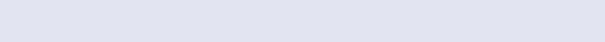

# Colors

## Wala Teal

### Usage

Wala Teal is our brand color, and we want to associate it with action and positivity inside the app. Despite being the brand color, we use the base color fairly sparingly in an effort to focus a user's association of the color with certain elements, primarily [`<CallToActionButton />`](content/buttons/calltoactionbutton.md)   
  
Acceptable uses for Wala Teal include:

* [`<CallToActionButton />`](content/buttons/calltoactionbutton.md)
* Icons indicating an action a user is about to take
* Success messages
* labels for deposits


### Values

#### _Base Color_


`AUI_COLORS.WalaTeal.hex`


#### _Shades_

```javascript
AUI_COLORS.WalaTeal.getRgba(opacity)
```


`AUI_COLORS.WalaTeal.shade1`


`AUI_COLORS.WalaTeal.shade2`


`AUI_COLORS.WalaTeal.shade3`


`AUI_COLORS.WalaTeal.shade4`


#### _Tints_


`AUI_COLORS.WalaTeal.tint1`


`AUI_COLORS.WalaTeal.tint2`


`AUI_COLORS.WalaTeal.tint3`


`AUI_COLORS.WalaTeal.tint4`


### Functions

#### getRgba\(\)

```jsx
AUI_COLORS.WalaTeal.getRgba(opacity)
```

This returns an rgba value using `AUI_COLORS.WalaTeal.hex` as the base, useful for transparent backgrounds.

| **argument** | **type** | **description** |
| --- | --- |
| opacity | number | an opacity value between 0 and 1 |


#### getShade\(\)

```jsx
AUI_COLORS.WalaTeal.getShade(percent)
```

This function will darken `AUI_COLORS.WalaTeal.hex` by a given percent, and returns a hex value

| **argument** | **type** | **description** |
| --- | --- |
| percent | number | a percentage value between 0 an 1 |


#### getTint\(\)

```jsx
AUI_COLORS.WalaTeal.getTint(percent)
```

This function will brighten `AUI_COLORS.WalaTeal.hex` by a given percent, and returns a hex value

| **argument** | **type** | **description** |
| --- | --- |
| percent | number | a percentage value between 0 and 1 |

## Torch Red

### Usage

Torch Red is used sparingly throughout the app, to indicate errors or negative activity. We don't want to encourage negativity in the app, nor give users a sense that they are doing something incorrect, so use this color sparingly. That said, because Torch Red's base color is so striking, it can also be used for a notification [`<Badge />`](content/badge.md) to make it noticeable.  
  
Example uses for Torch Red include:

* Severe errors
* Account Withdrawals \(usually a lighter tint instead of the aggressive base color\)
* Notification [`<Badge />`](content/badge.md)
* Deleting and similar actions
* labels for withdrawals


### Values

#### _Base Color_


`AUI_COLORS.TorchRed.hex`


#### _Shades_


`AUI_COLORS.TorchRed.shade1`


`AUI_COLORS.TorchRed.shade2`


`AUI_COLORS.TorchRed.shade3`


`AUI_COLORS.TorchRed.shade4`


#### _Tints_


`AUI_COLORS.TorchRed.tint1`


`AUI_COLORS.TorchRed.tint2`


`AUI_COLORS.TorchRed.tint3`


`AUI_COLORS.TorchRed.tint4`


### Functions

#### getRgba\(\)

```jsx
AUI_COLORS.TorchRed.getRgba(opacity)
```

This returns an rgba value using `AUI_COLORS.TorchRed.hex` as the base, useful for transparent backgrounds.

| **argument** | **type** | **description** |
| --- | --- |
| opacity | number | an opacity value between 0 and 1 |


#### getShade\(\)

```jsx
AUI_COLORS.TorchRed.getShade(percent)
```

This function will darken `AUI_COLORS.TorchRed.hex` by a given percent, and returns a hex value

| **argument** | **type** | **description** |
| --- | --- |
| percent | number | a percentage value between 0 and 1 |


#### getTint\(\)

```jsx
AUI_COLORS.TorchRed.getTint(percent)
```

This function will brighten `AUI_COLORS.TorchRed.hex` by a given percent, and returns a hex value

| **argument** | **type** | **description** |
| --- | --- |
| percent | number | a percentage value between 0 and 1 |

## Poppy Yellow

### Usage

This is used as a light warning and transitional color, as it is less aggressive than Torch Red.  
  
Examples uses for Poppy Yellow include:

* Site Maintenance announcements
* User states that merit caution or review \(e.g., non sufficient funds\)
* Pending Status


### Values

#### _Base Color_


`AUI_COLORS.PoppyYellow.hex`


#### _Shades_


`AUI_COLORS.PoppyYellow.shade1`


`AUI_COLORS.PoppyYellow.shade2`


`AUI_COLORS.PoppyYellow.shade3`


`AUI_COLORS.PoppyYellow.shade4`


#### _Tints_


`AUI_COLORS.PoppyYellow.tint1`


`AUI_COLORS.PoppyYellow.tint2`


`AUI_COLORS.PoppyYellow.tint3`


`AUI_COLORS.PoppyYellow.tint4`


### Functions

#### getRgba\(\)

```jsx
AUI_COLORS.PoppyYellow.getRgba(opacity)
```

This returns an rgba value using `AUI_COLORS.PoppyYellow.hex` as the base, useful for transparent backgrounds.

| **argument** | **type** | **description** |
| --- | --- |
| opacity | number | an opacity value between 0 and 1 |


#### getShade\(\)

```jsx
AUI_COLORS.PoppyYellow.getRgba(percent)
```

This function will darken `AUI_COLORS.PoppyYellow.hex` by a given percent, and returns a hex value

| **argument** | **type** | **description** |
| --- | --- |
| percent | number | a percentage value between 0 and 1 |


#### getTint\(\)

```jsx
AUI_COLORS.PoppyYellow.getRgba(percent)
```

This function will brighten `AUI_COLORS.PoppyYellow.hex` by a given percent, and returns a hex value

| **argument** | **type** | **description** |
| --- | --- |
| percent | number | a percentage value between 0 and 1 |

## Curious Blue

### Usage

Curious Blue is used for data representation, informative UI, and neutral activity  
  
Example uses for Curious Blue include:

* Charts and Graphs
* Informational notices \(did you know?\)
* labels for intra-account transfers


### Values

#### _Base Color_


`AUI_COLORS.CuriousBlue.hex`


#### _Shades_


`AUI_COLORS.CuriousBlue.shade1`


`AUI_COLORS.CuriousBlue.shade2`


`AUI_COLORS.CuriousBlue.shade3`


`AUI_COLORS.CuriousBlue.shade4`


#### _Tints_


`AUI_COLORS.CuriousBlue.tint1`


`AUI_COLORS.CuriousBlue.tint2`


`AUI_COLORS.CuriousBlue.tint3`


`AUI_COLORS.CuriousBlue.tint4`


### Functions

#### getRgba\(\)

```jsx
AUI_COLORS.CuriousBlue.getRgba(opacity)
```

This returns an rgba value using `AUI_COLORS.CuriousBlue.hex` as the base, useful for transparent backgrounds.

| **argument** | **type** | **description** |
| --- | --- |
| opacity | number | an opacity value between 0 and 1 |


#### getShade\(\)

```jsx
AUI_COLORS.CuriousBlue.getRgba(percent)
```

This function will darken `AUI_COLORS.CuriousBlue.hex` by a given percent, and returns a hex value

| **argument** | **type** | **description** |
| --- | --- |
| percent | number | a percentage value between 0 and 1 |


#### getTint\(\)

```jsx
AUI_COLORS.CuriousBlue.getRgba(percent)
```

This function will brighten `AUI_COLORS.CuriousBlue.hex` by a given percent, and returns a hex value

| **argument** | **type** | **description** |
| --- | --- |
| percent | number | a percentage value between 0 and 1 |

## Scampi Purple

### Usage

Scampi Purple is used fairly often, as it pairs well with Wala Teal. Think of this as a secondary brand color, since we want to reserve Wala Teal for specific UX. The various shades and tints of Scampi Purple are also heavily featured in Dala-related UI/UX.  
  
Example uses for Scampi Purple include:

* Icons
* Headlines and Titles
* Dialog Headers


### Values

#### _Base Color_


`AUI_COLORS.ScampiPurple.hex`


#### _Shades_


`AUI_COLORS.ScampiPurple.shade1`


`AUI_COLORS.ScampiPurple.shade2`


`AUI_COLORS.ScampiPurple.shade3`


`AUI_COLORS.ScampiPurple.shade4`


#### _Tints_


`AUI_COLORS.ScampiPurple.tint1`


`AUI_COLORS.ScampiPurple.tint2`


`AUI_COLORS.ScampiPurple.tint3`



`AUI_COLORS.ScampiPurple.tint4`


### Functions

#### getRgba\(\)

```jsx
AUI_COLORS.ScampiPurple.getRgba(opacity)
```

This returns an rgba value using `AUI_COLORS.ScampiPurple.hex` as the base, useful for transparent backgrounds.

| **argument** | **type** | **description** |
| --- | --- |
| opacity | number | an opacity value between 0 and 1 |


#### getShade\(\)

```jsx
AUI_COLORS.ScampiPurple.getRgba(percent)
```

This function will darken `AUI_COLORS.ScampiPurple.hex` by a given percent, and returns a hex value

| **argument** | **type** | **description** |
| --- | --- |
| percent | number | a percentage value between 0 and 1 |


#### getTint\(\)

```jsx
AUI_COLORS.ScampiPurple.getRgba(percent)
```

This function will brighten `AUI_COLORS.ScampiPurple.hex` by a given percent, and returns a hex value

| **argument** | **type** | **description** |
| --- | --- |
| percent | number | a percentage value between 0 and 1 |

## Charcoal

### Usage

Charcoal is essentially the Wala substitute for black. NEVER USE BLACK. The general vibe of the app is colorful and light, so Charcoal is used primarily as a text color for text that needs to stand out in some way to a user. It is also used for overlays and backdrops.  
  
Example uses for Charcoal include:

* Background overlays for modals
* Labels in lists
* [`<SectionHeadline />`](../compounds/sectionheader.md) backgrounds
* if you need to darken the background of a section of content


### Values

#### _Base Color_


`AUI_COLORS.Charcoal.hex`


#### _Tints_


`AUI_COLORS.Charcoal.tint1`


`AUI_COLORS.Charcoal.tint2`


`AUI_COLORS.Charcoal.tint3`


`AUI_COLORS.Charcoal.tint4`


### Functions

#### getRgba\(\)

```jsx
AUI_COLORS.Charcoal.getRgba(opacity)
```

This returns an rgba value using `AUI_COLORS.Charcoal.hex` as the base, useful for transparent backgrounds.

| **argument** | **type** | **description** |
| --- | --- |
| opacity | number | an opacity value between 0 and 1 |


#### getTint\(\)

```jsx
AUI_COLORS.Charcoal.getRgba(percent)
```

This function will brighten `AUI_COLORS.Charcoal.hex` by a given percent, and returns a hex value

| **argument** | **type** | **description** |
| --- | --- |
| percent | number | a percentage value between 0 and 1 |

## Slate

### Usage

Slate is primarily used as our default text color. With a couple exceptions, no text against a white background should be lighter than Slate.  
  
Example uses of Slate include:

* Text

### Value


`AUI_COLORS.Slate.hex`


### Functions

#### getRgba\(\)

```jsx
AUI_COLORS.Slate.getRgba(opacity)
```

This returns an rgba value using `AUI_COLORS.Slate.hex` as the base, useful for transparent backgrounds.

| **argument** | **type** | **description** |
| --- | --- |
| opacity | number | an opacity value between 0 and 1 |

## Iron

### Usage

Iron is primarily used with [Inputs](../compounds/inputs.md).  
  
Example uses for Iron are:

* Input field borders
* Input helper text
* Form subheaders


### Value


`AUI_COLORS.Iron.hex`


### Functions

#### getRgba\(\)

```jsx
AUI_COLORS.Iron.getRgba(opacity)
```

This returns an rgba value using `AUI_COLORS.Iron.hex` as the base, useful for transparent backgrounds.

| **argument** | **type** | **description** |
| --- | --- |
| opacity | number | an opacity value between 0 and 1 |

## Silver

### Usage

Silver is used primarily in the [`<Divider />`](layout/divider.md) Element and as borders for other UI. It can solo occasionally be used as a background in place of white.

### Value


`AUI_COLORS.Silver.hex`


### Functions

#### getRgba\(\)

```jsx
AUI_COLORS.Silver.getRgba(opacity)
```

This returns an rgba value using `AUI_COLORS.Silver.hex` as the base, useful for transparent backgrounds.

| **argument** | **type** | **description** |
| --- | --- |
| opacity | number | an opacity value between 0 and 1 |

## Other Functions

### getRgbaFromHex\(\)

```jsx
AUI_COLORS.getRgbaFromHex(hex, opacity)
```

This returns an rgba value using any hex colors as the base.

| **argument** | **type** | **description** |
| --- | --- | --- |
| hex | string | any hex color, i.e. \#FF0000 |
| opacity | number | an opacity value between 0 and 1 |

